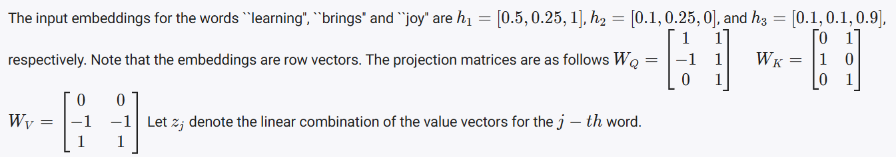

# DATA FOR Q1-Q3:

- What is word embedding?
    - The word embedding is the representation of a word in a vector space that captures the meaning of a word.
    - ex: the word "dog" is represented by a vector that captures the meaning of the word "dog".

- What is the embedding dimension of each word?
    - The embedding dimension is the number of dimensions in the vector space that captures the meaning of a word.
## Question 1: 


- What is a transformer?
    - A transformer is a type of neural network that is used for natural language processing, where the input is a sequence of words and the output is a sequence of words, and the model is trained to predict the next word in the sequence, given the previous words in the sequence.
    - ex: The transformer is used in the GPT-3 model, which is a large language model that is used for natural language processing.
- What is minimun context length?
    - The minimum context length is the number of words that must be in the input sequence to predict the next word in the sequence.

### Answer: 

- The minimum context length (or window size) in the context of transformers refers to the smallest number of tokens (e.g., words or subwords) that the model can consider at a time to process a sequence completely. 
- This parameter is critical because transformers operate on fixed-length sequences. If the context length is smaller than the longest sequence, the model will be unable to process that sequence in its entirety.

- Why is it important?

    - For transformers to capture relationships between tokens in a sequence, the context length must be large enough to encompass all tokens in the longest sequence. 
    - Otherwise, some tokens will be truncated or ignored.

- What determines it?

    - The context length is determined by the longest sequence in the dataset. 
    - If a sequence exceeds this length, the model won't be able to process it fully without truncation or splitting.

- Consider the dataset:
    - Sequence 1: "I enjoyed the movie Transformers" (5 tokens)
    - Sequence 2: "We live among its people now" (6 tokens)
    - Sequence 3: "They have much to learn" (5 tokens)
    - Sequence 4: "Freedom is the right of all sentient beings" (8 tokens)

- The longest sequence contains 8 tokens. To ensure the transformer processes this sequence in its entirety, the minimum context length T must be 8.
- Thus, the minimum context length ensures that the transformer can handle the largest sequence in the dataset without truncating any tokens.

## Question 2:


### Answer: 

- Number of sequences: There are 4 sequences in the dataset.
- Maximum sequence length: 
    - The longest sequence contains 8 tokens. 
    - All sequences will be padded to ensure they have the same length, resulting in a sequence length of 8 for each sequence.
- Embedding dimension per token: Each token is represented as a vector of dimension 
- Batch size: Since all 4 sequences are being processed in a batch, the batch size is 4.

### Input Dimensions to the Encoder:

- The input to the encoder consists of the token embeddings for all sequences in the batch. The tensor shape will have:

    - Batch size: 4 (4 sequences).
    - Sequence length: 8 (maximum length of the sequences).
    - Embedding dimension: 256

- Thus, the input tensor to the encoder will have the dimensions: (batch size × sequence length × embedding dimension).


## Question 3:


### Answer: 
#### Parameters in the projection matrices (WQ, WK, WV):

- Each attention head requires three projection matrices: WQ, WK, WV.​
- Each of these matrices maps the embedding dimension (256) to the attention head dimension.

- Formula: 
    ```
    Number of parameters in one matrix = input dimension × output dimension
    ```

- For one attention head:
    - Parameters per matrix = 256 × 64 = 16384
- Output dimension = 64 (Embedding dimension / number of heads)


- For WQ, WK, WV combined for one attention head:
    - 16384 × 3 = 49152
- Since there are 4 attention heads, the total parameters for 
WQ, WK, WV across all heads are:
    - 49152 × 4 = 196608

#### Parameters in the output projection matrix (WO):

- The WO matrix maps the concatenated outputs of all 4 attention heads back to the embedding dimension (256). 
- Since the concatenated outputs have a dimension of  4 × 64 = 256, WO has the following number of parameters: 
    - 256 × 256 = 65536

#### Total Parameters:

- The total number of parameters in the multi-head attention sub-layer is the sum of:
- Parameters in WQ, WK and WV: 196608
- Parameters in WO: 65536
- Total Parameters = 196608 + 65536 = 262144

# DATA FOR Q4-Q6:


### Explanation of the data:

- The diagram illustrates how attention mechanisms work in transformers for a given word (it_). Key observations are:

    - Attention Heads: There are three independent attention heads (h1, h2, h3), each represented by a different color.
    - Sequence of Tokens: The input sequence includes words like "The_", "animal_", "didn_'t", etc., forming a sentence.
    - Attention Matrix: For each head (hi), there is an attention matrix Ai of size m × n. This matrix stores attention scores between tokens. The rows of Ai​ represent the tokens being attended to (queries), while the columns represent the tokens providing the information (keys).
    - Special Token: A special token appears as the last row and column of the matrix.

## Question 4: (Doubt)


## Question 5: (Doubt)


## Question 6:


### Answer:

- In the diagram, each attention head is represented by different colors, and the intensity of the color (shades of red in this case) indicates how strongly one word attends to another.
- For h3, the attention line between "it_" and "animal_" is darker (stronger red), which shows a stronger relationship between these two words in this attention head.
- Thus, h3 captures a stronger relation between the words "it_" and "animal_".

## DATA FOR Q7-Q8:



## Question 7:


### Step 1: Computing Queries, Keys, and Values
- To calculate the attention output for the word z1 (linear combination of value vectors for the first word, "learning"), we first need to compute the queries Q, keys 
K, and values V for all words using the projection matrices 
WQ, WK, and WV.


Step 2: Attention Calculation
Now, we need to calculate the attention weights for 
z
1
z 
1
​
  (for "learning"). In a typical attention mechanism, the attention scores are computed as the dot product between the query and the keys for each word. We then apply a softmax to normalize the scores and get the attention weights.

For 
z
1
z 
1
​
 , attention scores are calculated as follows:

Attention score for 
j
t
h
 word
=
Q
1
⋅
K
j
Attention score for j 
th
  word=Q 
1
​
 ⋅K 
j
​
 
For the word "learning" (i.e., 
z
1
z 
1
​
 ):

The attention score between 
Q
1
=
[
0.25
,
1.75
]
Q 
1
​
 =[0.25,1.75] and 
K
1
=
[
0.75
,
1.25
]
K 
1
​
 =[0.75,1.25] will give us the strongest weight for "learning" itself, showing that it attends most to itself.
The correct conclusion is that more attention was given to the word "learning", which is the focal point of 
z
1
z 
1
​
 .

Final Answer:
The statement "while constructing 
z
1
z 
1
​
 , more attention was given to the word 'learning'" is true.