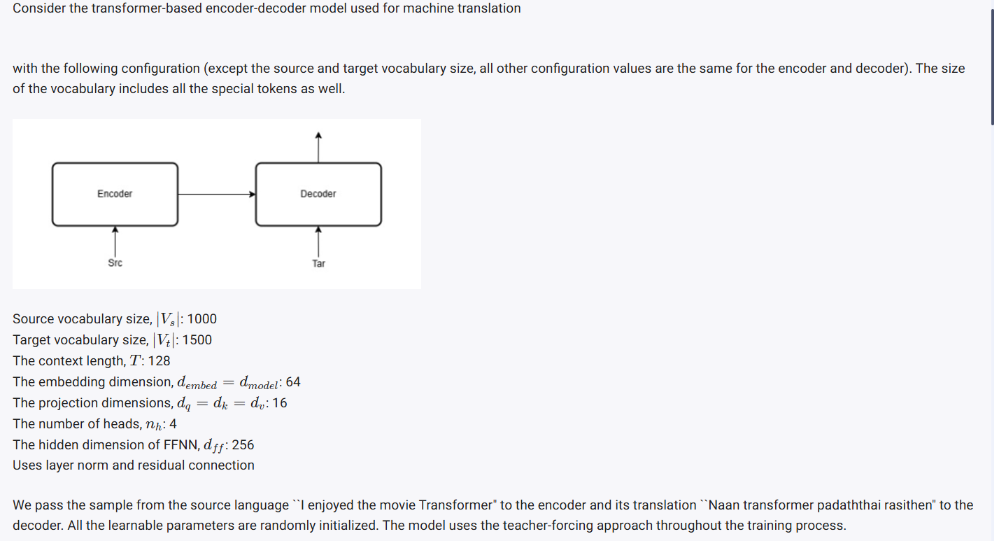
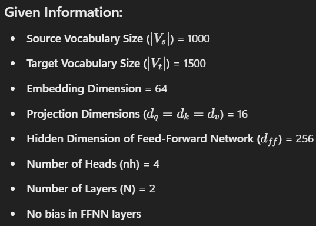
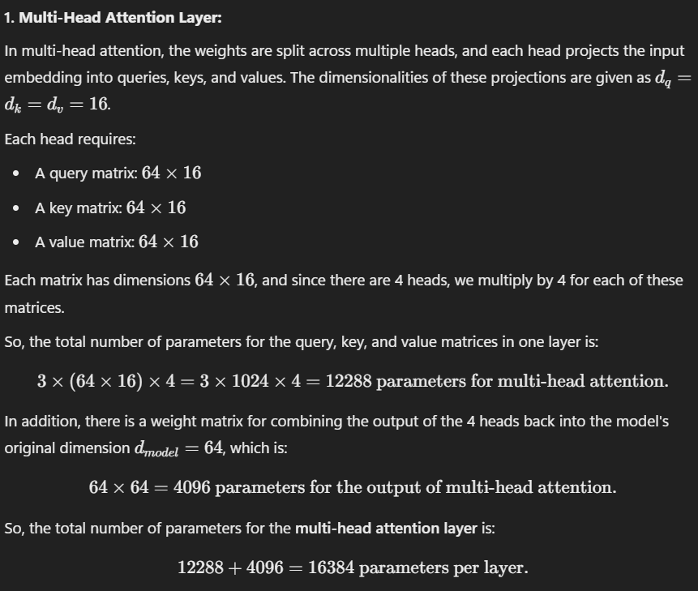
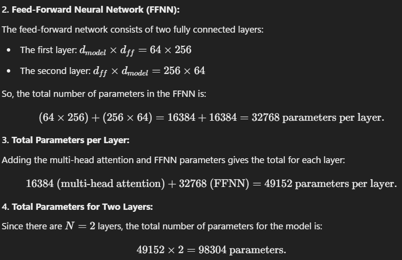
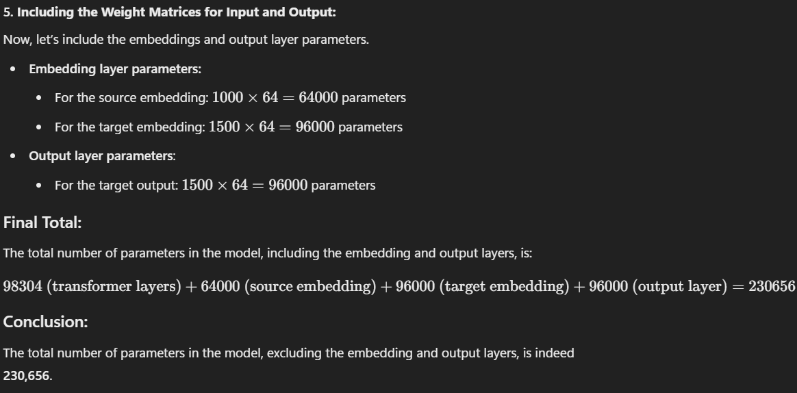
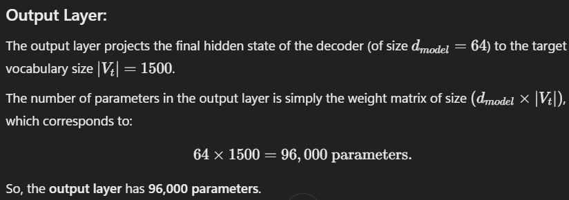
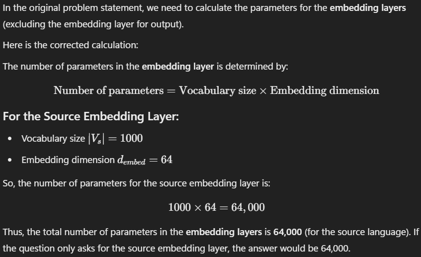
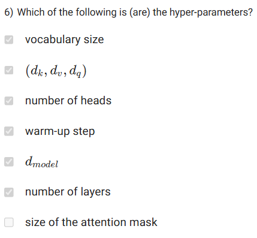
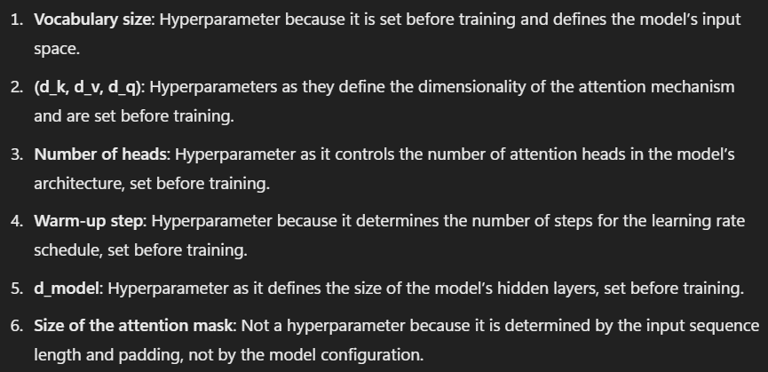

# DATA:

- The image describes a transformer-based encoder-decoder model used for machine translation, with the following configuration:

### Key Parameters:
- Source Vocabulary Size (∣Vs∣): 1000
    - This refers to the number of unique tokens (words, subwords, characters, etc.) in the source language vocabulary.

- Target Vocabulary Size (∣Vt∣): 1500
    - This refers to the number of unique tokens in the target language vocabulary.

- Context Length (T): 128
    - The context length (T) specifies the number of tokens (words or subwords) considered for each sentence during translation.

- Embedding Dimension (dembed=dmodel): 64
    - The dimensionality of the input token embeddings and the model's hidden states.

- Projection Dimensions (dq=dk=dv): 16
    - The dimensions for the query (dq), key (dk), and value (dv) vectors in the attention mechanism. 
    - These are the sizes of the representations used during the self-attention computation.

- Number of Heads (nh): 4
    - The number of attention heads in the multi-head attention mechanism, allowing the model to focus on different parts of the input simultaneously.

- Hidden Dimension of Feed-Forward Neural Network (dff): 256
    - The size of the hidden layer in the feed-forward network, which is used after the attention layer.

- Layer Norm and Residual Connections: 
    - These techniques are used in the transformer model to help with training stability and to improve performance.

### Model Operation:

- The transformer model consists of an Encoder and Decoder:

    - The Encoder takes the source sentence as input and converts it into hidden representations.

    - The Decoder generates the target language translation by using these representations and previously generated target tokens.

### Example:

- Source Sentence: "I enjoyed the movie Transformer."
- Target Translation: "Naan transformer padatthai rasithen" (Translation in Tamil).
The model uses the teacher-forcing approach, where the actual previous target token is fed to the decoder during training (rather than using the decoder's own predictions from the previous time step). This approach speeds up training and improves accuracy. All learnable parameters of the model (weights) are randomly initialized.

# Question 1:

1. Assume the model has two layers (N=2). Calculate the total number of parameters in the model (excluding the embedding layer and output layer). Moreover, no bias was added to the neuron in the FFNN layers.

## Answer:

# Question 2:

2. How many parameters does the output layer have?

## Answer: 

# Question 3:

3. How many parameters do the embedding layers have?

## Answer: 

# Question 4:

4. At time step t=1, the prediction probability for the words "Nann", "transformer" and "padaththai" are 0.55, 0.15 and 0.2, respectively. What is the probability for the word ``rasithen"? If you think, the given information is insufficient enter -1.

## Answer: 

- Based on the given information, the probability values for words "Nann", "transformer", and "padaththai" are 0.55, 0.15, and 0.2, respectively, at time step t=1.

- However, the probability for the word "rasithen" cannot be directly calculated with the given information.

- In language models like the transformer-based encoder-decoder, the prediction probabilities for words are typically normalized such that the sum of all possible word probabilities at a given time step equals 1. 

- Since we don't have the complete probability distribution for all possible words in the vocabulary (including "rasithen"), we cannot determine the exact probability for the word "rasithen" without knowing the remaining probabilities.

- Therefore, the answer is -1, as the given information is insufficient to determine the probability for the word "rasithen".

# Question 5: (Doubt)

# Question 6:

## Answer: 

# Question 7: (Doubt)
